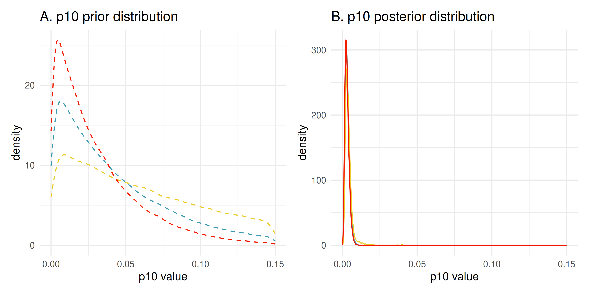

First we will load the package:

```{r, warning = FALSE, message = FALSE}
# load the package
library(eDNAjoint)

# and other packages used in this workshop
library(tidyverse)
library(bayestestR)
library(patchwork)
library(wesanderson)
```

# Prepare the data

Ensuring that your data is formatted correctly is essential for successfully using eDNAjoint. Let’s first explore the structure of the goby data:

```{r}
data(goby_data)
str(goby_data)
```

The input data is a list of matrices, where the rows in all matrices correspond to the number of sites.

```{r}
names(goby_data)
```

## Count data

Let's look at the dimensions of the count data:

```{r}
dim(goby_data$count)
```

Number of primary samples (sites) = 39
Maximum number of secondary samples (replicates per site) = 22

These are the number of gobies in each seine sample, at each site.

```{r}
head(goby_data$count)
```
Because we are building these matrices based on the maximum dimensions, we fill in the matrix with NAs for samples that don't exist. For example, at site 1, there were only 11 seine replicates, so columns 12-22 in row 1 are NA.

Site 11 has the maximum number of replicate observations (22):

```{r}
goby_data$count[11,]
```

## eDNA (PCR) data

Next let's look at the PCR data. `pcr_n` is the number of PCR replicates, per eDNA secondary sample (water sample), per site. These are the PCR "attempts".

```{r}
tail(goby_data$pcr_n)
```

How many PCR replicates were there at site 4, water sample 6?

```{r}
as.numeric(goby_data$pcr_n[4, 6])
```

`pcr_k` is the number of PCR successes. Of the number of PCR replicates, how many were detections were there?

```{r}
tail(goby_data$pcr_k)
```

How many PCR detections (successes) were there at site 4, water sample 6?

```{r}
as.numeric(goby_data$pcr_k[4, 6])
```

A few checks to make sure the data is structured correctly:

The locations of the NA should be the same in the `pcr_k` and `pcr_n` matrices.

```{r}
all(which(is.na(goby_data$pcr_k)) == which(is.na(goby_data$pcr_n)))
```

Both PCR and count data should have the same number of sites (i.e., number of rows):

```{r}
all.equal(nrow(goby_data$pcr_k), nrow(goby_data$pcr_n), nrow(goby_data$count))
```

## Site-level covariate data

Site-level covariate data is totally optional! PCR and count data are the minimum.

```{r}
head(goby_data$site_cov)
```

Notice that the continuous data is normalized:

```{r}
round(mean(goby_data$site_cov[, "Salinity"]))
```

```{r}
sd(goby_data$site_cov[, "Salinity"])
```

# Fit the model

Now that we understand our data, let’s fit the model using the function `joint_model`. The key arguments of this function include:

 * `data`: list of pcr_k, pcr_n, count, and site_cov matrices

 * `cov`: character vector of site-level covariates 
 
 * `family`: probability distribution used to model the seine count data. Options include a poisson, negative binomial, and gamma 
 
 * `p10_priors`: Beta distribution parameters for the prior on the probability of false positive eDNA detection, p10. c(1,20) is the default specification. More on this later.
 
 * `q`: logical value indicating the presence of multiple traditional gear types.
 
```{r}
# run the joint model with two covariates
goby_fit_cov1 <- joint_model(
  data = goby_data, # data
  cov = c("Filter_time", "Salinity"), # site-level covariates
  family = "poisson", # distribution for traditional data
  p10_priors = c(1, 20), # specify prior distribution for p10
  q = FALSE, # only one traditional gear type
  multicore = TRUE # run MCMC chains in parallel
)
```

There are many more arguments, including more to customize the MCMC algorithm, but these are the primary arguments.

Now let's look at the return object:

```{r}
names(goby_fit_cov1)
```

The first element of this list is the model, of class `stanfit`. This model object can be used with functions in the `rstan` package.

```{r}
class(goby_fit_cov1$model)
```

And the second element of the list are the initial values used to start the MCMC. And this will indicate the initial values used for each of the four MCMC chains.

```{r}
length(goby_fit_cov1$inits)
```

# Model selection

In the first model, we used salinity and filter time as our site level covariates. Perhaps we want to see how this model compares to models that include other covariates.

Here we will include the binary variable that indicates vegetation presence:

```{r}
# fit a new model with one site-level covariate
goby_fit_cov2 <- joint_model(data = goby_data, 
                             cov = "Veg",
                             family = "poisson", 
                             p10_priors = c(1, 20),
                             q = FALSE, 
                             multicore = TRUE,
                             verbose = FALSE # don't print messages!
                            )
```

And now we will use the `joint_select` function to compare our two models. We will input our two models as a list:

```{r, message = FALSE, warning = FALSE}
# perform model selection
joint_select(model_fits = list(goby_fit_cov1$model, goby_fit_cov2$model))
```

This is performing model selection with leave-one-out cross validation and is a measure of how well a model predicts new, unseen data. A higher ELPD (Expected Log Predictive Density) value indicates better predictive performance, meaning the model is better at predicting new data.

You could test this with all the covariates, but we will stick with model 1 (salinity and filter time) for now.

# Summarize the posterior

The model fit object contains our posterior samples, and we can use the `joint_summarize` function to create summaries of the distributions.

First let's look at the `p10` parameter:

```{r}
joint_summarize(goby_fit_cov1$model, par = "p10")
```

Here, we see the mean, standard deviation, lower and upper bounds of the 95% credibility interval, the effective sample size, and Rhat.

Let's plot this marginal posterior as a density plot:

```{r}
ggplot() +
  geom_density(aes(x = as.matrix(goby_fit_cov1$model)[, "p10"]),
               fill = "purple", alpha = 0.4) +
  labs(x = "p10 estimate", y = "density") +
  theme_minimal()
```

Let's plot the traceplot of `p10`:

```{r}
# get chains for param p10
chain1_p10 <- as.array(goby_fit_cov1$model)[, "chain:1", "p10"]
chain2_p10 <- as.array(goby_fit_cov1$model)[, "chain:2", "p10"]
chain3_p10 <- as.array(goby_fit_cov1$model)[, "chain:3", "p10"]
chain4_p10 <- as.array(goby_fit_cov1$model)[, "chain:4", "p10"]

ggplot() +
  geom_line(aes(x = 1:length(chain1_p10), y = chain1_p10),
            color = "dodgerblue") +
  geom_line(aes(x = 1:length(chain2_p10), y = chain2_p10),
            color = "firebrick") +
  geom_line(aes(x = 1:length(chain3_p10), y = chain3_p10),
            color = "violet") +
  geom_line(aes(x = 1:length(chain4_p10), y = chain4_p10),
            color = "goldenrod") +
  labs(x = "iteration", y = "p10 estimate") +
  theme_minimal()
```

Now let's look at the summaries of `mu`, which is the expected catch rate at each site:

```{r}
joint_summarize(goby_fit_cov1$model, par = "mu")
```

Now on to interpreting the site-level covariates:

`beta` is the parameter in the model that scales the sensitivity of eDNA samples, relative to traditional samples, and it is site specific and a function of our covariates:

$$
\beta_i = \alpha_1 + \alpha_2 \times FilterTime_i + \alpha_3 \times Salinity_i
$$
As `beta` increases, the sensitivity of eDNA sampling decreases. So a positive regression coefficient would indicate an inverse relationship between the value of the covariate and the sensitivity of eDNA.

So let's look at the marginal posterior summaries of `alpha`:

```{r}
joint_summarize(goby_fit_cov1$model, par = "alpha")
```

`alpha[1]` is the regression intercept and indicates the sensitivity of eDNA at the *average* site.

`alpha[2]` is the regression coefficient for filter time. Since this is positive, this means that at sites where the filter time is longer, the sensitivity of eDNA is lower.

`alpha[3]` is the regression coefficient for salinity. Since this is negative, this means that at sites with higher salinity, the sensitivity of eDNA is higher.


# Compare detection rates

To compare the relative sensitivity of eDNA and traditional sampling, we can use `detection_plot()` to find the units of survey effort necessary to detect presence of the species. 

Here, detecting presence refers to producing at least one true positive eDNA detection or catching at least one individual in a traditional survey.

This is calculated for an average site:

$$
\beta_i = \alpha_1 + \alpha_2 \times FilterTime_i + \alpha_3 \times Salinity_i
$$
$$
\beta_i = \alpha_1 + \alpha_2 \times 0 + \alpha_3 \times 0
$$

```{r}
detection_plot(goby_fit_cov1$model, 
               mu_min = 0.1, mu_max = 1, # min and max mu
               cov_val = c(0, 0), # mean covariate values
               probability = 0.9)
```

How does this change if we do not calculate for a site with mean covariate values?

This is calculating the effort necessary to detect presence for a site with a filter time 0.5 z-scores above the mean:

$$
\beta_i = \alpha_1 + \alpha_2 \times 0.5 + \alpha_3 \times 0
$$

```{r}
detection_plot(goby_fit_cov1$model, 
               mu_min = 0.1, mu_max = 1, # min and max mu
               cov_val = c(0.5, 0), # high filter time
               probability = 0.9)
```

Now let's do the same for salinity:

$$
\beta_i = \alpha_1 + \alpha_2 \times 0 + \alpha_3 \times 0.5
$$

```{r}
detection_plot(goby_fit_cov1$model, 
               mu_min = 0.1, mu_max = 1, # min and max mu
               cov_val = c(0, 0.5), # high salinity
               probability = 0.9)
```


# Prior sensitivity analysis

When we first fit our model, we used the default prior distribution for $p10$, the probability of a false positive eDNA detection:

```{r, eval = FALSE}
# run the joint model with two covariates
goby_fit_cov1 <- joint_model(
  data = goby_data,
  cov = c("Filter_time", "Salinity"), 
  family = "poisson",
  p10_priors = c(1, 20), # specify prior distribution for p10
  q = FALSE,
  multicore = TRUE 
)
```

These are the shape parameters of a beta distribution that reflects our prior belief about the probability of a false positive. And this prior belief is updated with our data to give use our posterior estimate.

The default parameters give us a prior for p10 that is relatively uninformative:

```{r}
p10_prior <- rbeta(10000, shape1 = 1, shape2 = 20)

ggplot() +
  geom_histogram(aes(x = p10_prior)) +
  labs(x = "p10 prior", y = "") +
  theme_minimal()
```

With this prior, 99% of the probability density is less than 0.2.

```{r}
1 - qbeta(0.2, shape1 = 1, shape2 = 20)
```

We could keep this prior relatively uninformative, or we could use data to create the prior, perhaps from negative controls. 

For example, let’s say you used 25 negative qPCR controls during eDNA data processing. You can assume that the probability of a false positive is less than $1 / 25 = 0.04$. To reflect this data, you could create a prior where the $probability(p10 > 0.04)$ is low:

```{r}
p10_negative_control <- rbeta(n = 10000, shape1 = 1, shape2 = 100)

ggplot() +
  geom_histogram(aes(x = p10_negative_control)) +
  labs(x = "p10 prior", y = "count") +
  theme_minimal()
```

With an informative prior, it is good practice to do a prior sensitivity analysis. Here, we are testing how sensitive our posterior inference is to the choice of prior.

If the posterior is not sensitive to the prior, this means that the posterior is more driven by the information in the data, rather than by the prior.

So we could run our model again with different priors:

```{r, message = FALSE, warning = FALSE}
fit_prior2 <- joint_model(data = goby_data, family = "poisson",
                          cov = c("Filter_time", "Salinity"),
                          p10_priors = c(1, 15), # new prior
                          q = FALSE, verbose = FALSE,
                          multicore = TRUE)
```

```{r, message = FALSE, warning = FALSE}
fit_prior3 <- joint_model(data = goby_data, family = "poisson",
                          cov = c("Filter_time", "Salinity"),
                          p10_priors = c(1, 25), # new prior
                          q = FALSE, verbose = FALSE,
                          multicore = TRUE)
```

And then compare the posteriors of `p10`:

Model 1:

```{r}
joint_summarize(goby_fit_cov1$model, par = "p10")
```

Model 2:

```{r}
joint_summarize(fit_prior2$model, par = "p10")
```

Model 3:

```{r}
joint_summarize(fit_prior3$model, par = "p10")
```


```{r, warning = FALSE, message = FALSE}
# get samples
samples_20 <- rstan::extract(goby_fit_cov1$model, pars = "p10")$p10
samples_10 <- rstan::extract(fit_prior2$model, pars = "p10")$p10
samples_30 <- rstan::extract(fit_prior3$model, pars = "p10")$p10

# plot
prior_plot <- ggplot() +
  geom_density(aes(x = rbeta(100000, 1, 20)), color = wes_palette("Zissou1")[1],
               linetype = "dashed") + # blue
  geom_density(aes(x = rbeta(100000, 1, 10)), color = wes_palette("Zissou1")[3],
               linetype = "dashed") + # yellow
  geom_density(aes(x = rbeta(100000, 1, 30)), color = wes_palette("Zissou1")[5],
               linetype = "dashed") + # red
  scale_x_continuous(limits = c(0, 0.15)) +
  labs(x = "p10 value", y = "density") +
  ggtitle("A. p10 prior distribution") +
  theme_minimal()

posterior_plot <- ggplot() +
  geom_density(aes(x = samples_20), color = wes_palette("Zissou1")[1]) +
  geom_density(aes(x = samples_10), color = wes_palette("Zissou1")[3]) +
  geom_density(aes(x = samples_30), color = wes_palette("Zissou1")[5]) +
  scale_x_continuous(limits = c(0, 0.15)) +
  labs(x = "p10 value", y = "density") +
  ggtitle("B. p10 posterior distribution") +
  theme_minimal()

prior_plot + posterior_plot + plot_layout(ncol = 2)
```

```{r dh-figure, echo=FALSE}

```

